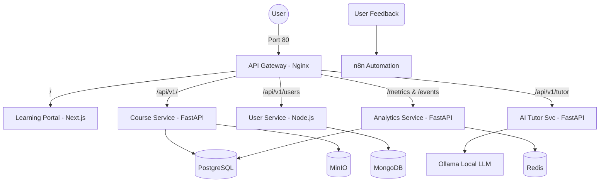

# E-learning Microservice Platform 🎓

A scalable, AI-powered e-learning platform built with a microservices architecture. This project integrates modern web technologies, AI assistance (using local LLMs), and automated feedback workflows.

## 🏗️ Architecture

The platform follows a microservices architecture managed by Docker Compose, with an Nginx API Gateway routing requests to specialized backend services and the frontend.



## 🚀 Key Features

- **AI Tutor:** Contextual Q&A based on course content, automated quiz generation, and personalized recommendations powered by a local Ollama LLM.
- **n8n Automation:** Automated feedback collection workflow with AI enrichment and notifications.
- **Analytics Dashboard:** Tracking enrollments, course completions, and learning trends.
- **Learning Portal:** Modern, responsive interface built with Next.js and shadcn/ui.
- **API Gateway:** Centralized Nginx proxy for seamless routing between frontend and microservices.

## 🛠️ Technology Stack

| Component | Technology |
| :--- | :--- |
| **Frontend** | Next.js, shadcn/ui, Tailwind CSS |
| **Backend Services** | FastAPI (Python), Express (Node.js) |
| **AI Integration** | Ollama (Local LLM) |
| **API Gateway** | Nginx |
| **Databases** | PostgreSQL, MongoDB |
| **Caching & Storage** | Redis, MinIO |
| **Automation** | n8n |
| **DevOps** | Docker, Docker Compose |

## 📦 Services Overview

| Service | Responsibility | Internal Port | Exposed Via Gateway |
| :--- | :--- | :--- | :--- |
| **nginx-gateway** | Reverse proxy & API Gateway | `8000` | `80` (HTTP) |
| **learning-portal** | Public portal (Next.js) | `3000` | `/` |
| **course-service** | Course & lesson management (FastAPI) | `8001` | `/api/v1/` |
| **user-service** | Auth (JWT) & profile management (Node.js) | `8002` | `/api/v1/users` |
| **analytics-service** | Tracking & trends (FastAPI) | `8003` | `/metrics`, `/events` |
| **ai-tutor-service** | AI Q&A & quiz generation (FastAPI) | `8004` | `/api/v1/tutor` |
| **n8n-automation** | Feedback workflows | `5678` | `5678` |

## 🛠️ Getting Started

### Prerequisites

- Docker and Docker Compose installed.

### Installation & Deployment

1. **Clone the repository:**
   ```bash
   git clone <repository-url>
   cd elearning-microservice-platform
   ```

2. **Configure Environment Variables:**
   Copy `.env.example` to `.env` and fill in any required secrets (the example file contains secure defaults for local development).
   ```bash
   cp .env.example .env
   ```

3. **Launch the platform (Production Build):**
   Use the production docker-compose file which sets up the API Gateway and routes all traffic internally.
   ```bash
   docker compose -f docker-compose.prod.yml up -d --build
   ```

4. **Access the services:**
   - **Frontend Learning Portal:** `http://localhost`
   - **n8n Editor:** `http://localhost:5678`

## 📁 Project Structure

```text
elearning-microservice-platform/
├── backend/
│   ├── analytics-service/   # Tracking & Trends (FastAPI)
│   ├── course-service/      # Content Management (FastAPI)
│   ├── user-service/        # Identity Management (Node.js)
│   └── ai-tutor-service/    # AI Assistance with Ollama (FastAPI)
├── learning-portal/         # Frontend Next.js Application
├── gateway/                 # Nginx Configuration
├── docker-compose.yml       # Development Orchestration
├── docker-compose.prod.yml  # Production Orchestration with Gateway
└── README.md                # Project Documentation
```

## 🎓 Master DevOps & Cloud - 2026
This project is part of the integration project for the Master DevOps & Cloud program.
