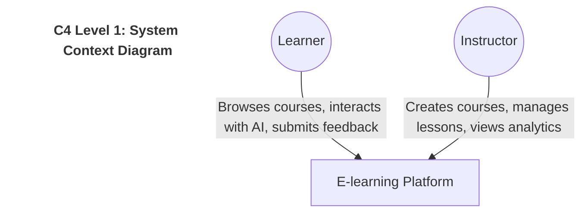
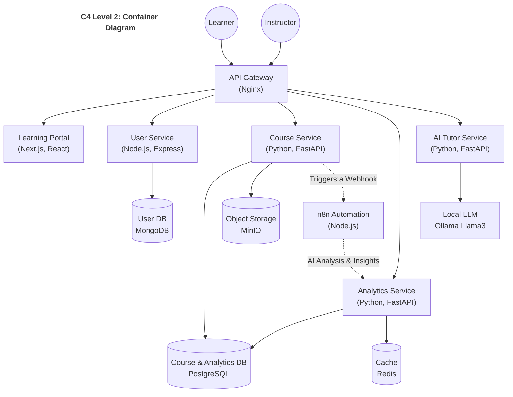
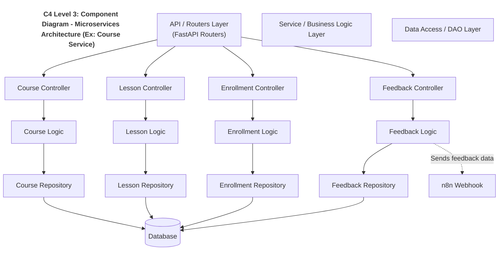
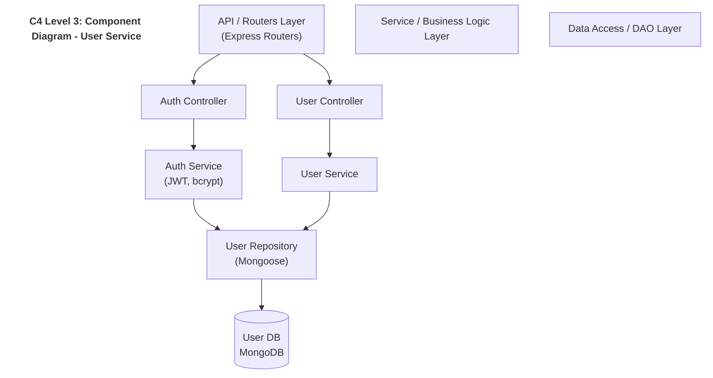
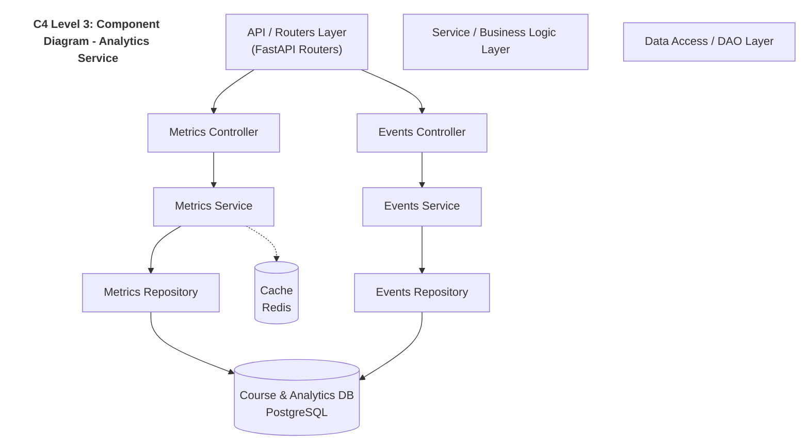
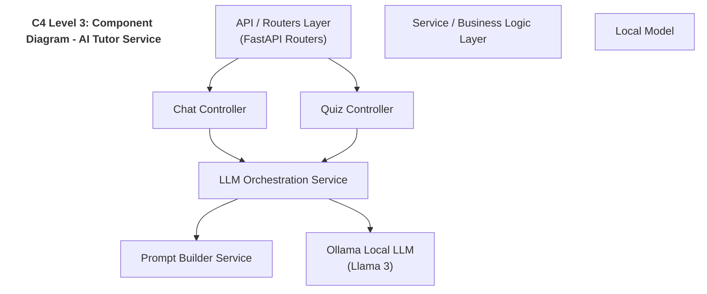
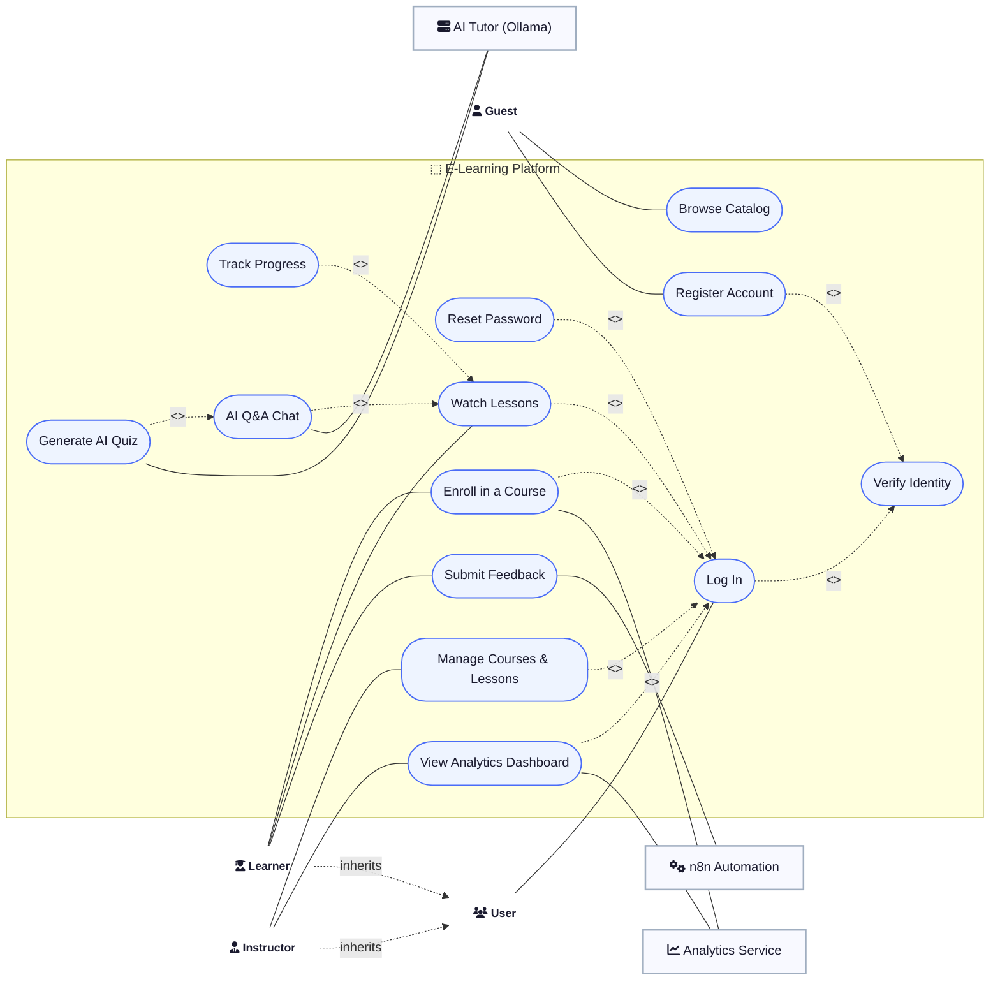
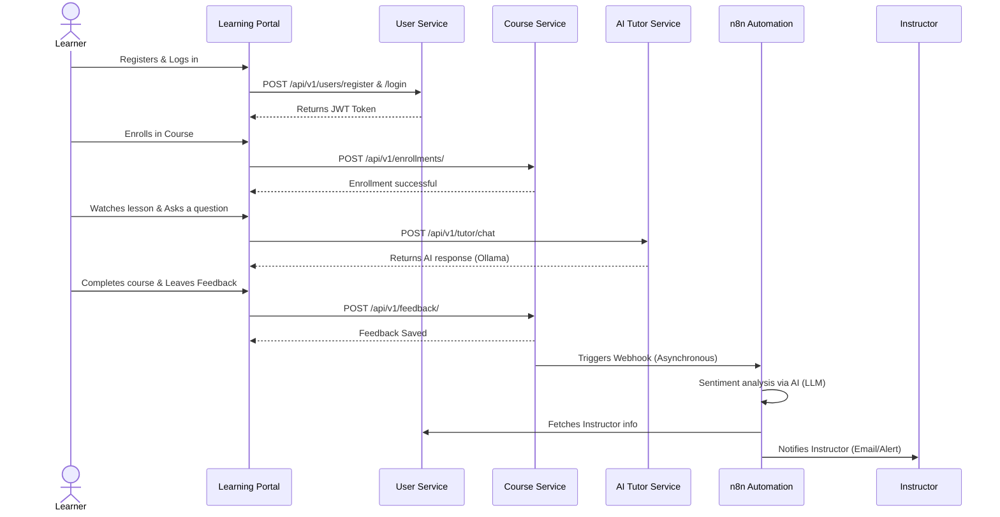
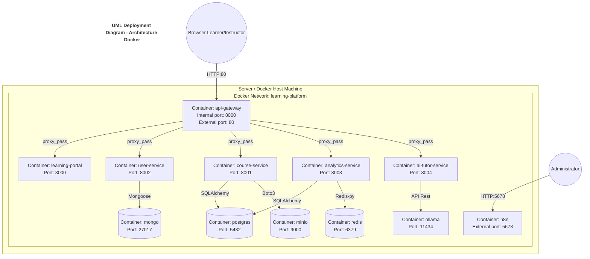

# Platform Architecture (C4 Model & UML)

This document describes the architecture of the e-learning platform based on the C4 model for overall structuring, complemented by UML diagrams to detail behaviors, data structure, and deployment.

---

## 1. C4 Model

### Level 1: Context Diagram
The context diagram shows the overall system of the e-learning platform and its interactions with external actors.

### Level 2: Container Diagram
The container diagram breaks down the system into applications, databases, and microservices.

### Level 3: Component Diagram
Each microservice (Course, User, Analytics, AI Tutor) adopts a standard layered architecture (Controllers, Services, DAO/Repositories). Here is the detailed example for the course microservice (`course-service`).

#### User Service

#### Analytics Service

#### AI Tutor Service

---

## 2. UML Diagrams

### Use Case Diagram
It represents the possible interactions between actors (Learners and Instructors) and the platform's features.

### Class Diagram
It models the structure of the main data entities and their relationships across all microservices.

### Sequence Diagram
Example business flow: Registration ➔ Course Access ➔ AI Tutor Interaction ➔ Feedback ➔ n8n Workflow.

### Deployment Diagram
Represents the underlying Docker infrastructure, instantiated containers, their exposed ports, and network links managed via Docker Compose.

