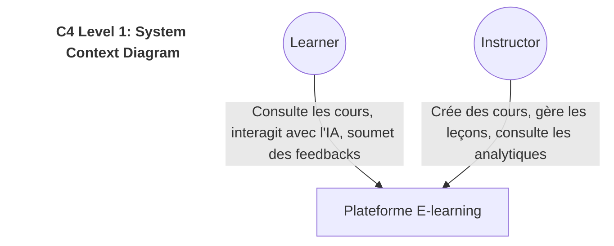
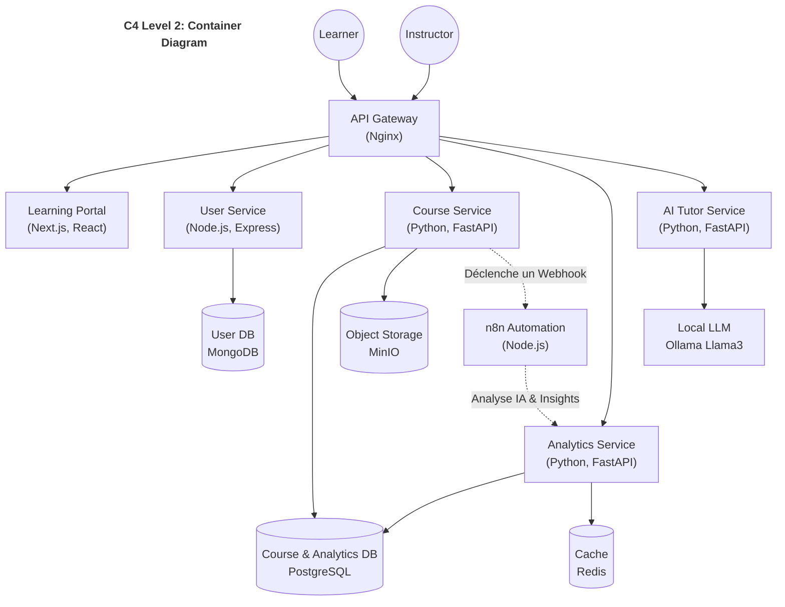
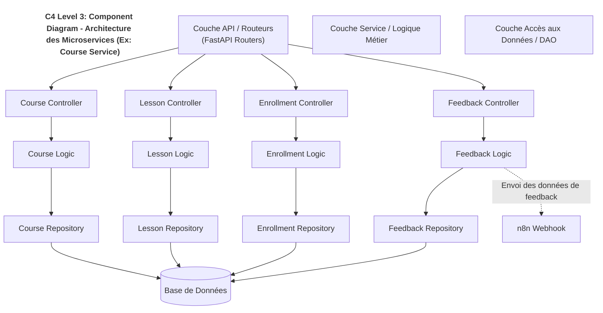
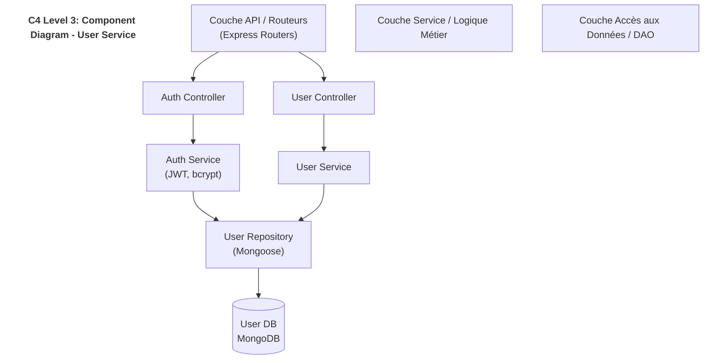
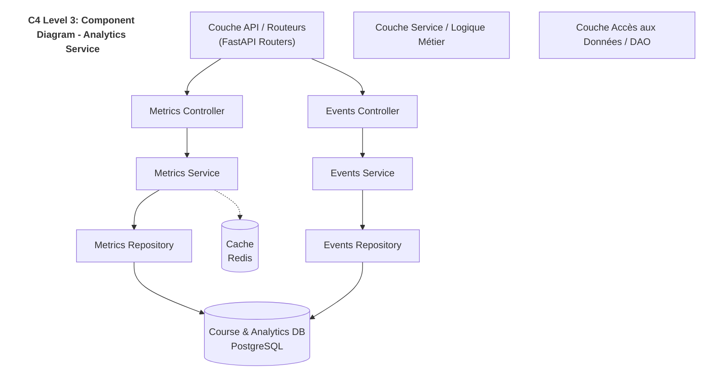
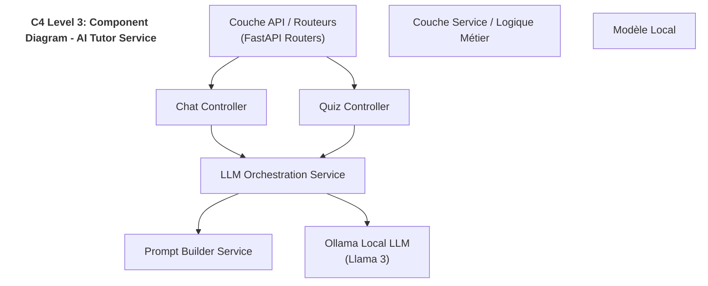
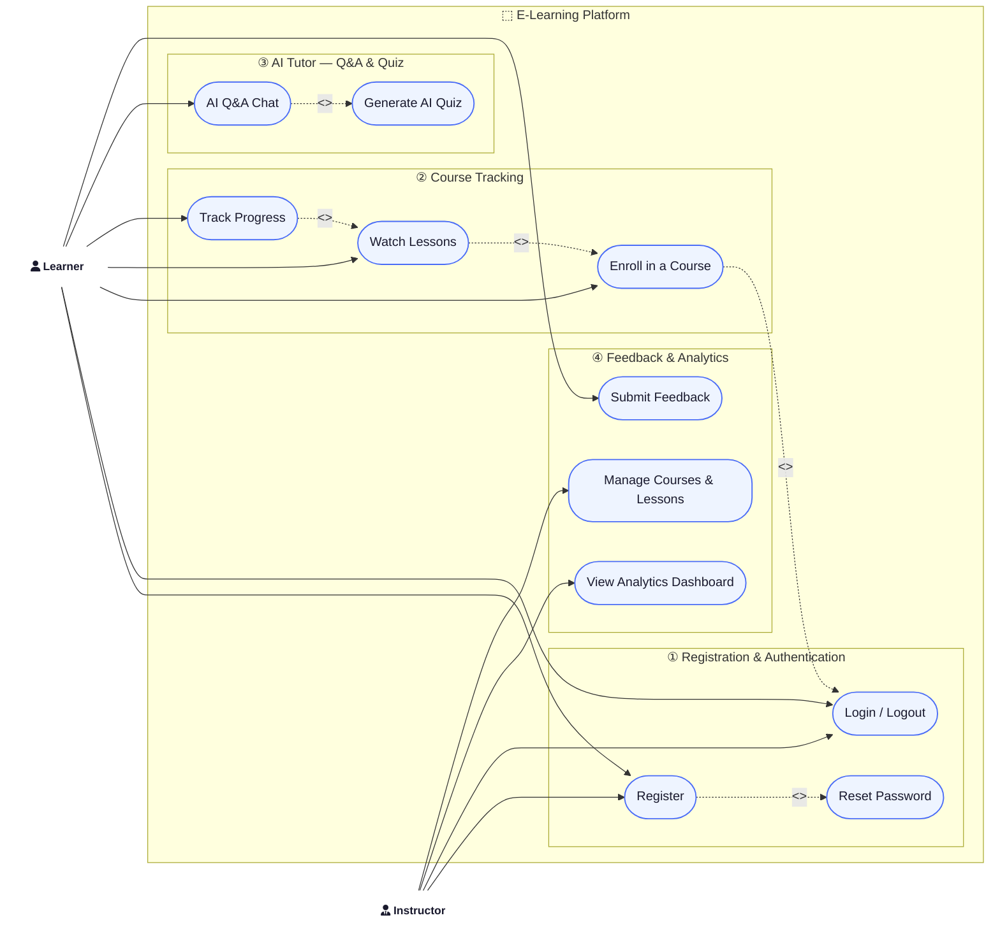
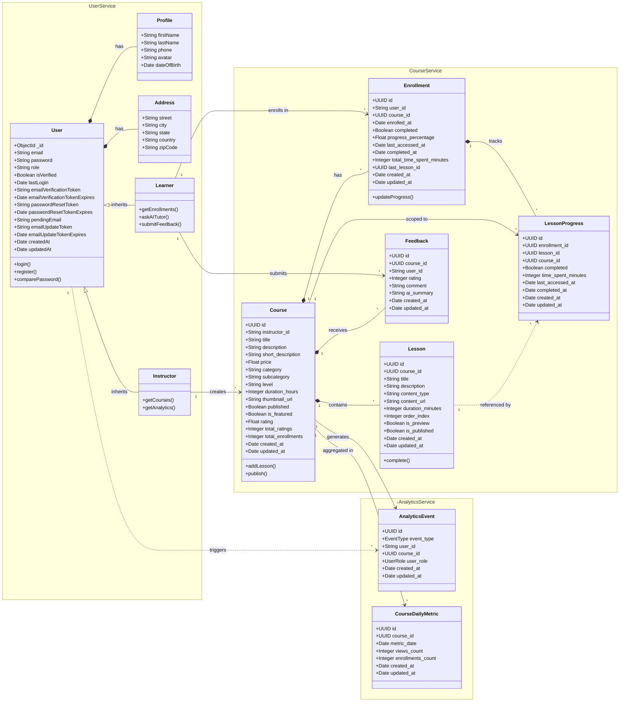
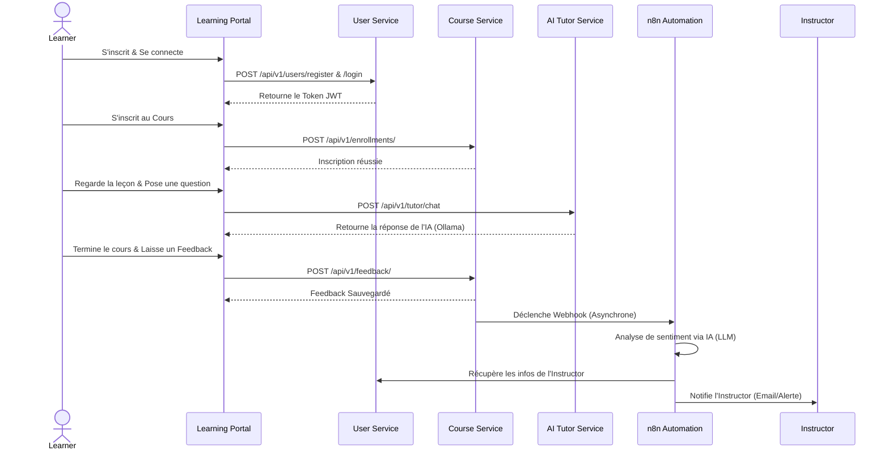
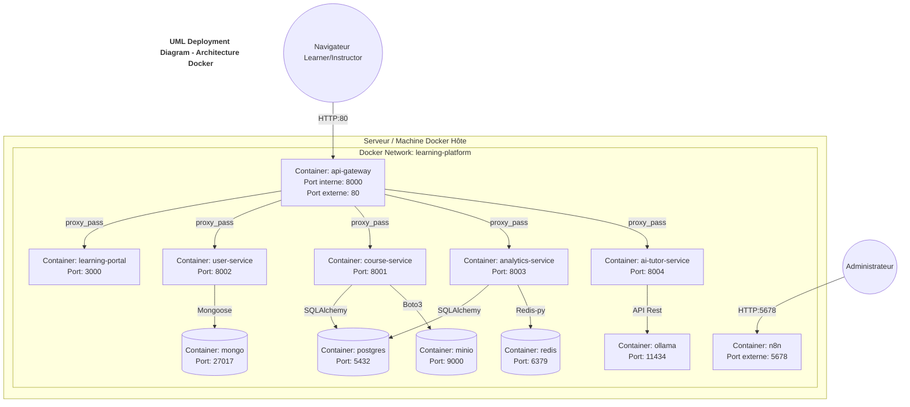

# Architecture de la Plateforme (C4 Model & UML)

Ce document décrit l'architecture de la plateforme e-learning en s'appuyant sur le modèle C4 pour la structuration globale, complété par des diagrammes UML pour détailler les comportements, la structure des données et le déploiement.

---

## 1. Modèle C4

### Niveau 1 : Context Diagram (Diagramme de Contexte)
Le diagramme de contexte montre le système global de la plateforme e-learning et ses interactions avec les acteurs externes.

### Niveau 2 : Container Diagram (Diagramme de Conteneurs)
Le diagramme de conteneurs décompose le système en applications, bases de données et microservices.

### Niveau 3 : Component Diagram (Diagramme de Composants)
Chaque microservice (Course, User, Analytics, AI Tutor) adopte une architecture en couches standard (Contrôleurs, Services, DAO/Repositories). Voici l'exemple détaillé pour le microservice des cours (`course-service`).

#### User Service

#### Analytics Service

#### AI Tutor Service

---

## 2. Diagrammes UML

### Diagramme de Cas d'Utilisation (Use Case Diagram)
Il représente les interactions possibles entre les acteurs (Learners et Instructors) et les fonctionnalités de la plateforme.

### Diagramme de Classes (Class Diagram)
It models the structure of the main data entities and their relationships across all microservices.

### Diagramme de Séquence (Sequence Diagram)
Exemple de flux métier : Inscription ➔ Accès au cours ➔ Interaction AI Tutor ➔ Feedback ➔ n8n Workflow.

### Diagramme de Déploiement (Deployment Diagram)
Représente l'infrastructure Docker sous-jacente, les conteneurs instanciés, leurs ports exposés et les liaisons réseaux gérées via Docker Compose.

